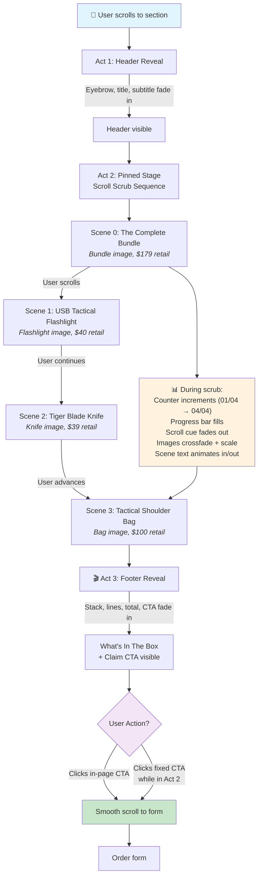

# SHTF Bundle Showcase — Narrative Flowchart

**Pattern**: Scroll-triggered narrative  
**Component**: [SHTF_BundleShowcase_HF.html](Hyperframes/BundleShowcase/SHTF_BundleShowcase_HF.html)  
**Tech**: GSAP 3.14.2 + ScrollTrigger, 3 animated acts, 4-scene pinned sequencing

## User Journey

## Scene Sequencing Details

| Scene | Trigger | Content | Animation |
|-------|---------|---------|-----------|
| **0** | Initial state | Bundle image + "Complete Kit" title, $179 | Visible at start |
| **1** | Scroll ~0-25% | Flashlight image + "USB Tactical Flashlight", $40 | Cross-fade + text slide in |
| **2** | Scroll ~25-50% | Knife image + "Tiger Blade Knife", $39 | Cross-fade + text slide in |
| **3** | Scroll ~50-100% | Bag image + "Tactical Shoulder Bag", $100 | Cross-fade + text slide in |

## CTA Flow

**Fixed CTA** (floating button, lower third):
- Appears when section enters viewport (85% from top)
- Visible while user is in Act 2 (pinned stage)
- Hides once Act 3 footer reaches 70% of viewport
- Click → `scrollToForm()`

**In-Page CTA** (Act 3 footer):
- Reveals as footer scrolls into view (75% from top)
- Persistent on page
- Click → `scrollToForm()`

Both target `#form-target` or `[data-title="_ORDERFORM"]` (ClickFunnels order form)

## Responsive Behavior

- **Desktop (968px+)**: Grid layout (image left, info right), full-width hero/footer
- **Tablet/Mobile (<968px)**: Stacked layout (image top, info bottom), narrower CTAs
- **Reduced motion**: All animations disabled, static reveal (all elements visible), pinning disabled
- **No GSAP**: Fallback to static state (all elements visible, no pin, no animations)

## Assets

- Bundle image: `mtp-images.com/pr-photo-1426.webp`
- Flashlight: `mtp-images.com/pr-photo-1398.webp`
- Knife: `mtp-images.com/pr-photo-067.png`
- Bag: `mtp-images.com/pr-photo-664.webp`
- Background: `mtp-images.com/pr-photo-1419.png` (dark overlay, fixed)
